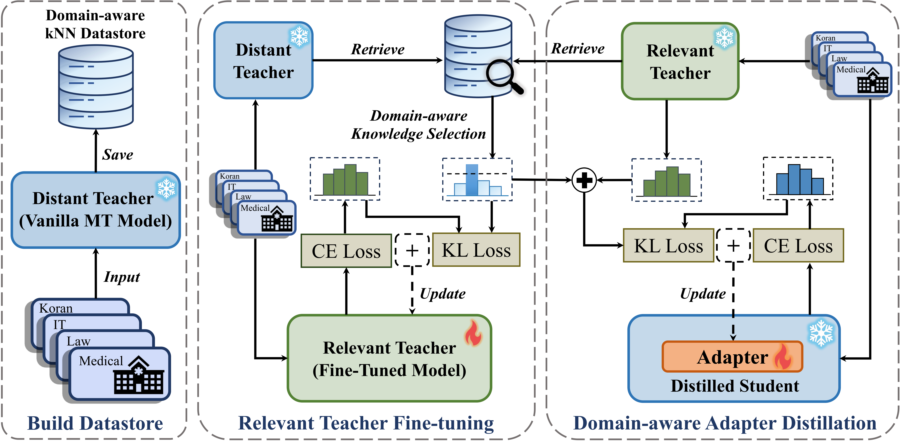

# D*k*-KD

<div align="center">
    </img>
    <p class="image-caption">Dk-KD: Domain-Aware k-Nearest-Neighbor Knowledge Distillation</p>
</div>


## **📣 News**

- **[15/05/2024] Our paper is accepted to the findings of [ACL 2024](https://2024.aclweb.org/) conference!**
- **[01/06/2024] Our code and dataset for D*k*-KD is released!**
- **[13/06/2024] Our paper is published on arXiv:**

## 🛠️ Requirements and Installation

Code framework based on [fairseq](https://github.com/facebookresearch/fairseq/tree/main) and [knnbox](https://github.com/NJUNLP/knn-box).

Configuration of the fairseq framework:
```shell
git clone https://github.com/wangzx1219/Dk-KD.git
cd Dk-KD
pip install --editable ./
```

Installation of other required environments:

```bash
pip install -r requirements.txt
```

## 💾 Data Preparation

Prepare pretrained models and dataset:

```bash
cd knnbox-scripts
bash prepare_dataset_and_model.sh
```

## ▶️ Train

Create datastore as with knnbox:

```shell
cd knnbox-scripts/vanilla-knn-mt
bash build_datastore.sh
```

Training a domain-aware teacher model:

```shell
cd Dk-KD_scripts
bash train_teacher.sh
```

Training domain-aware adapter layers:

```shell
bash train_adapter.sh
```

## 📏 Evaluation

After two stages of distillation, the results can be tested:

```shell
bash inference.sh
```

## 📝 Citation


```bibtex

```
